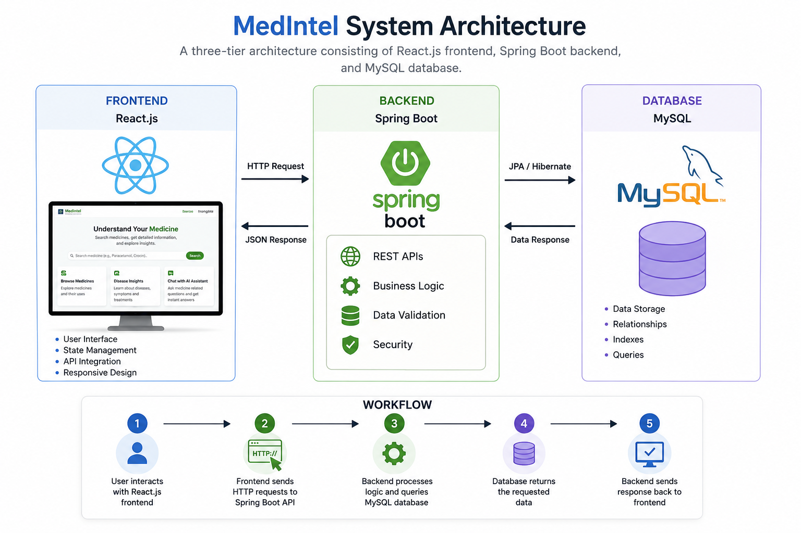
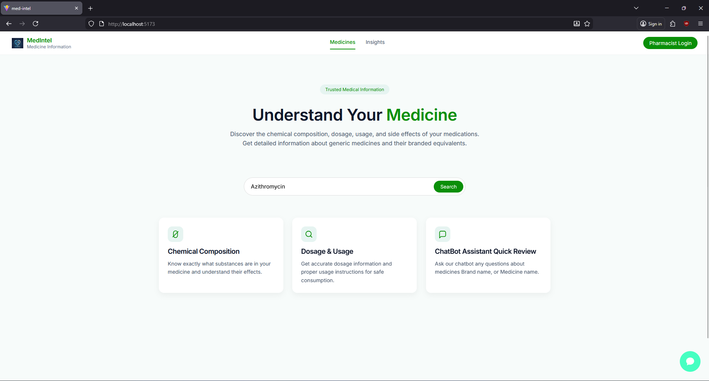
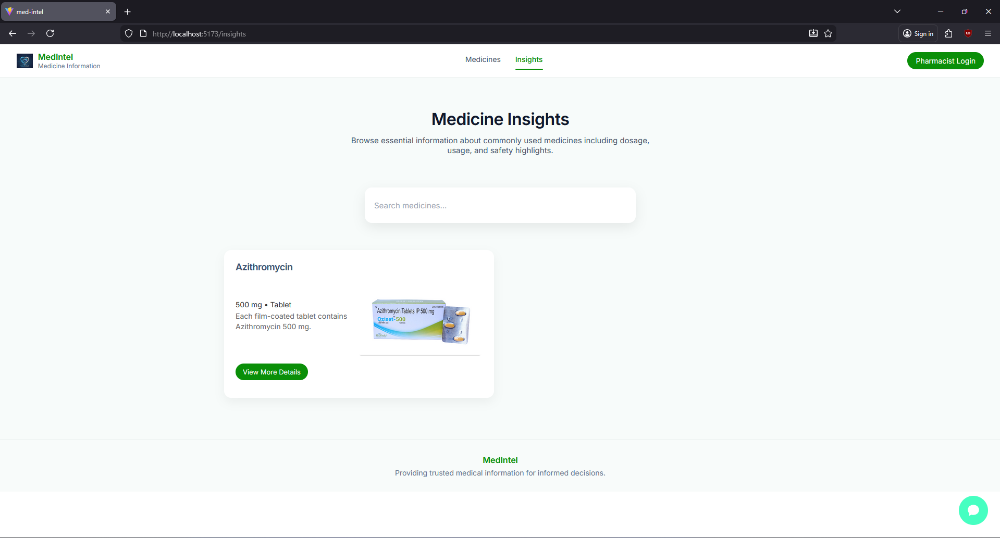
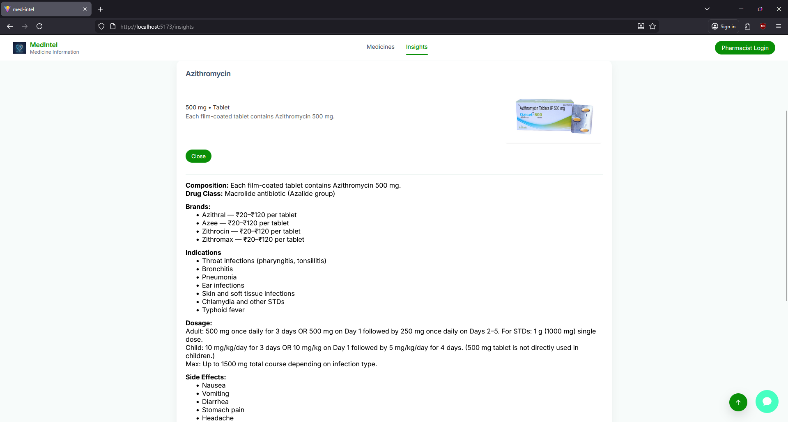
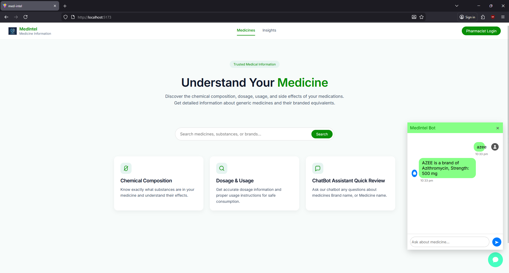

<div align="center">

# 💊 MedIntel

### Generic Medicine Information System

A Full-Stack Web Application built using **React.js**, **Spring Boot**, and **MySQL** to provide structured generic medicine information.

</div>

---
<div align="center">


</div>

---
## 📖 Overview

**MedIntel** is a full-stack web application designed to provide structured and reliable information about generic medicines through an intuitive and user-friendly interface. Users can search medicines, explore detailed medicine insights, and access information such as chemical composition, dosage, indications, side effects, precautions, interactions, and storage guidelines.

The application is developed using **React.js** for the frontend, **Spring Boot (Java)** for the backend, and **MySQL** for database management. It follows a three-tier architecture and uses REST APIs to enable seamless communication between the frontend and backend.

To enhance user experience, MedIntel also includes a **rule-based chatbot** that provides quick responses to medicine-related queries using predefined knowledge stored within the system.

---
## ✨ Features

* 🔍 Search medicines by **brand name** or **generic name**
* 💊 View detailed medicine information, including composition and dosage
* 📋 Display indications, precautions, interactions, side effects, and storage details
* 📖 View comprehensive medicine insights through a structured interface
* 🤖 Rule-based chatbot for medicine-related guidance
* 🌐 REST API integration between frontend and backend
* ⚡ Optimized medicine search using Data Structures & Algorithms (DSA)
* 📱 Responsive and user-friendly web interface

---

## 🛠️ Technology Stack

| Category              | Technologies                                                |
| --------------------- | ----------------------------------------------------------- |
| **Frontend**          | React.js, CSS3, JavaScript, Axios                           |
| **Backend**           | Java, Spring Boot, Spring Data JPA, Hibernate               |
| **Database**          | MySQL                                                       |
| **API**               | REST API                                                    |
| **Build Tool**        | Maven                                                       |
| **Version Control**   | Git, GitHub                                                 |
| **Development Tools** | Visual Studio Code, IntelliJ IDEA, MySQL Workbench, Postman |

---
## 🏗️ System Architecture

The MedIntel application follows a **three-tier architecture** consisting of a React.js frontend, a Spring Boot backend exposing REST APIs, and a MySQL database for persistent storage.

<p align="center">
  
</p>

### Workflow

1. The user interacts with the React.js frontend.
2. The frontend sends HTTP requests to the Spring Boot REST API.
3. The backend processes business logic and communicates with the MySQL database.
4. The database returns the requested data.
5. The backend sends the response back to the frontend for display.

---
## 📂 Project Structure

```text
MedIntel/
│
├── frontend/                  # React.js Frontend
│   ├── src/
│   ├── public/
│   └── README.md
│
├── backend/                   # Spring Boot Backend
│   ├── src/
│   ├── pom.xml
│   └── README.md
│
├── database/                  # MySQL Database Scripts
│   ├── schema/
│   ├── README.md
│
├── docs/                      # Project Documentation
│   ├── report/
│   ├── presentation/
│   └── README.md
│
├── README.md
├── .gitignore
└── LICENSE
```

---
## 🚀 Installation Guide

### Prerequisites

Before running the project, make sure the following software is installed on your system:

* Java 21 or later
* Node.js (v18 or later)
* MySQL 8.0
* Maven
* Git

---

### 1️⃣ Clone the Repository

```bash
git clone https://github.com/Saro-3/medintel.git
```

Navigate to the project folder:

```bash
cd medintel
```

---

### 2️⃣ Database Setup

1. Create a MySQL database named **medintel**.
2. Import the SQL scripts available in the `database/schema/` folder.
3. Update the MySQL username and password in:

```text
backend/src/main/resources/application.properties
```

---

### 3️⃣ Run the Backend

Navigate to the backend folder:

```bash
cd backend
```

Build and run the Spring Boot application:

```bash
mvn clean install
mvn spring-boot:run
```

The backend server will start at:

```text
http://localhost:8080
```

---

### 4️⃣ Run the Frontend

Open a new terminal and navigate to the frontend folder:

```bash
cd frontend
```

Install the dependencies:

```bash
npm install
```

Start the React development server:

```bash
npm run dev
```

The frontend will be available at:

```text
http://localhost:5173
```

---

### 5️⃣ Access the Application

Open your browser and visit:

```text
http://localhost:5173
```

The frontend will communicate with the Spring Boot backend using REST APIs.
## 📸 Application Screenshots

### 🏠 Home Page

The landing page introduces MedIntel and provides users with a search interface to explore medicine information.

<p align="center">
  
</p>

---

### 🔍 Medicine Search

Users can search medicines by entering a medicine name, brand name, or generic name.

<p align="center">
  
</p>

---

### 💊 Medicine Insights

Displays a collection of medicines with essential information and allows users to explore detailed medicine insights.

<p align="center">
  
</p>

---

### 📄 Medicine Details

Shows complete information about the selected medicine, including composition, dosage, indications, precautions, interactions, side effects, and storage information.

<p align="center">
  
</p>

---

### 🤖 Rule-Based Chatbot

A built-in chatbot that answers medicine-related questions using predefined rules and the application's medicine database.

<p align="center">
  
</p>

---
## 🧠 Data Structures & Algorithms

MedIntel applies fundamental Data Structures and Algorithms to improve the efficiency of medicine search and data management.

| DSA Concept       | Purpose                                                                                |
| ----------------- | -------------------------------------------------------------------------------------- |
| **HashMap**       | Stores medicine records for fast retrieval based on medicine or brand name.            |
| **ArrayList**     | Manages collections of medicine records returned from the database.                    |
| **Linear Search** | Finds medicines based on user-entered keywords before displaying detailed information. |

### Benefits

* ⚡ Faster medicine information retrieval
* 📂 Efficient in-memory data management
* 🔍 Simple and reliable search for medicine records
* 📈 Improved application performance for medicine lookup

---
## 📚 Documentation

The complete documentation for the **MedIntel** project is available in the `docs/` directory.

### Available Documents

* 📄 **MedIntel Project Report (PDF)** – Includes the project abstract, system design, database design, Data Flow Diagrams (DFD), testing, implementation details, and future enhancements.
* 📊 **Viva Voce Presentation (PPT)** – Presentation prepared for the project demonstration and Viva examination.

For additional information, refer to the `docs/README.md` file.

---
## 🚀 Future Enhancements

The following features are planned for future releases of MedIntel:

* 👨‍⚕️ Pharmacist authentication and secure login
* 📦 Inventory management for medicine stock monitoring
* 🛒 Medicine ordering system for hospitals and pharmacies
* 🚚 Real-time order tracking
* 🔔 Low-stock notifications
* ⏰ Medicine expiry date monitoring
* 📊 Dashboard with medicine usage analytics
* 🤖 AI-powered medicine assistant using Large Language Models (LLMs)

---
## 👨‍💻 Author

**Saravanan Thangaraj**

**M.Sc. Computer Science**

**Project:** MedIntel – Generic Medicine Information System

* GitHub: https://github.com/Saro-3
* Email: [sharewithsaravanan@gmail.com](mailto:sharewithsaravanan@gmail.com)

Thank you for visiting this repository. Feedback and suggestions are always welcome!

---
## 📄 License

This project is licensed under the MIT License.

See the `LICENSE` file for more information.